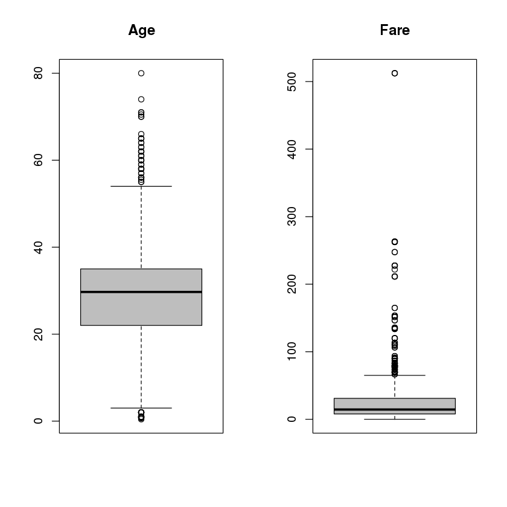
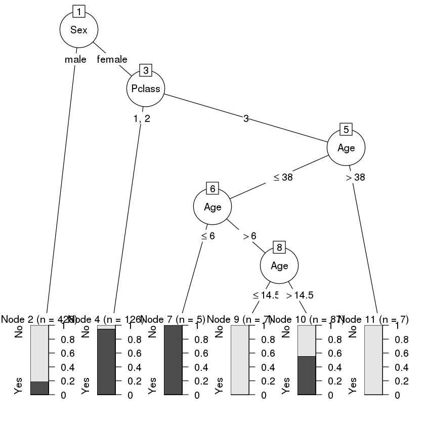

<div style="width: 100%; clear: both;">
<div style="float: left; width: 50%;">

</div>
<div style="float: right; width: 50%;">
<p style="margin: 0; padding-top: 22px; text-align:right;">M2.851 - Tipología y ciclo de vida de los datos aula 1 · Práctica 1</p>
<p style="margin: 0; text-align:right;">2018 · Máster universitario en Ciencia de datos (Data science)</p>
<p style="margin: 0; text-align:right;">Prof. Colaboradora: <b>Mireia Calvo Gonzalez</b></p>
<p style="margin: 0; text-align:right; padding-button: 100px;">Alumno: <b>Fernando Antonio Barbeiro Campos</b> - <a href="">fbarbeiro@uoc.edu</a></p>
</div>
</div>
<div style="width:100%;">&nbsp;</div>
<center><h1>Práctica 2 - Limpieza y validación de los datos</h1></center>


# Contenidos

1. [Dataset](#data1)

2. [Integración y selección de los datos de interés a analizar.](#data2)

3. [Limpieza de los datos.](#data3)
    
    3.1. [¿Los datos contienen ceros o elementos vacíos? ¿Cómo gestionarías cada uno de estos casos?](#data31)
    
    3.2. [Identificación y tratamiento de valores extremos.](#data32)
    
    
4. [Análisis de los datos.](#data4)

    4.1. [Selección de los grupos de datos que se quieren analizar/comparar (planificación de los análisis a aplicar).](#data41)
    
    4.2. [Comprobación de la normalidad y homogeneidad de la varianza.](#data42)
    
    4.3. [Aplicación de pruebas estadísticas para comparar los grupos de datos. En función de los datos y el objetivo del estudio, aplicar pruebas de contraste de hipótesis, correlaciones, regresiones, etc.](#data43)
    
    
5. [Representación de los resultados a partir de tablas y gráficas.](#data5)

6. [Resolución del problema. A partir de los resultados obtenidos, ¿cuáles son las conclusiones? ¿Los resultados permiten responder al problema?](#data6)

7. [Código](#data7)

8. [Referencias](#refer)

## 1. Dataset <a name="data1"></a>
*Descripción del dataset. ¿Por qué es importante y qué pregunta/problema pretende responder?*

He elegido el dataset ["**Titanic: Machine Learning from Disaster**" de Kagle](https://www.kaggle.com/c/titanic/overview). 

<center>Figura 1: Titanic</center>
<p></p>
La información presente en el dataset són datos sobre cada pasajero del famoso naufragio, si la persona sobrevivió o no, su sexo, tipo de cabina que estaba, entre otros.

Aunque hubo algún elemento de suerte involucrado en sobrevivir al hundimiento, algunos grupos de personas tenían más probabilidades de sobrevivir que otros, como las mujeres, los niños y la clase alta.

Justamente, el problema que buscamos a contestar es precisamente esto: hacer el análisis de **¿qué tipos de personas podrían sobrevivir?**


Aún hablando un poco sobre el dataset, vamos a mirar un poco más de información sobre el mismo:


```R
# Objetivo: Asegurar que estamos trabajando con el formato en ingles separado por comas
L <- readLines("train.csv", n = 1)
if (grepl(",", L)) print("File has an English format")
```

    [1] "File has an English format"


```R
# Como estamos trabajando con ficheros separados por commas, vamos a mirar un poco de datos
df <- read.csv("train.csv")
head(df)

# Mirando los nombres de columnas del dataframe y los tipos de variables y informacion adicional
print(paste("We are evaluating", nrow(df), "rows of code"))
print("Column's names: ")
colnames(df)
sapply(df,class)
str(df)
summary(df)
```


<table>
<thead><tr><th scope=col>PassengerId</th><th scope=col>Survived</th><th scope=col>Pclass</th><th scope=col>Name</th><th scope=col>Sex</th><th scope=col>Age</th><th scope=col>SibSp</th><th scope=col>Parch</th><th scope=col>Ticket</th><th scope=col>Fare</th><th scope=col>Cabin</th><th scope=col>Embarked</th></tr></thead>
<tbody>
	<tr><td>1                                                  </td><td>0                                                  </td><td>3                                                  </td><td>Braund, Mr. Owen Harris                            </td><td>male                                               </td><td>22                                                 </td><td>1                                                  </td><td>0                                                  </td><td>A/5 21171                                          </td><td> 7.2500                                            </td><td>                                                   </td><td>S                                                  </td></tr>
	<tr><td>2                                                  </td><td>1                                                  </td><td>1                                                  </td><td>Cumings, Mrs. John Bradley (Florence Briggs Thayer)</td><td>female                                             </td><td>38                                                 </td><td>1                                                  </td><td>0                                                  </td><td>PC 17599                                           </td><td>71.2833                                            </td><td>C85                                                </td><td>C                                                  </td></tr>
	<tr><td>3                                                  </td><td>1                                                  </td><td>3                                                  </td><td>Heikkinen, Miss. Laina                             </td><td>female                                             </td><td>26                                                 </td><td>0                                                  </td><td>0                                                  </td><td>STON/O2. 3101282                                   </td><td> 7.9250                                            </td><td>                                                   </td><td>S                                                  </td></tr>
	<tr><td>4                                                  </td><td>1                                                  </td><td>1                                                  </td><td>Futrelle, Mrs. Jacques Heath (Lily May Peel)       </td><td>female                                             </td><td>35                                                 </td><td>1                                                  </td><td>0                                                  </td><td>113803                                             </td><td>53.1000                                            </td><td>C123                                               </td><td>S                                                  </td></tr>
	<tr><td>5                                                  </td><td>0                                                  </td><td>3                                                  </td><td>Allen, Mr. William Henry                           </td><td>male                                               </td><td>35                                                 </td><td>0                                                  </td><td>0                                                  </td><td>373450                                             </td><td> 8.0500                                            </td><td>                                                   </td><td>S                                                  </td></tr>
	<tr><td>6                                                  </td><td>0                                                  </td><td>3                                                  </td><td>Moran, Mr. James                                   </td><td>male                                               </td><td>NA                                                 </td><td>0                                                  </td><td>0                                                  </td><td>330877                                             </td><td> 8.4583                                            </td><td>                                                   </td><td>Q                                                  </td></tr>
</tbody>
</table>


    [1] "We are evaluating 891 rows of code"
    [1] "Column's names: "


<ol class=list-inline>
	<li>'PassengerId'</li>
	<li>'Survived'</li>
	<li>'Pclass'</li>
	<li>'Name'</li>
	<li>'Sex'</li>
	<li>'Age'</li>
	<li>'SibSp'</li>
	<li>'Parch'</li>
	<li>'Ticket'</li>
	<li>'Fare'</li>
	<li>'Cabin'</li>
	<li>'Embarked'</li>
</ol>


<dl class=dl-horizontal>
	<dt>PassengerId</dt>
		<dd>'integer'</dd>
	<dt>Survived</dt>
		<dd>'integer'</dd>
	<dt>Pclass</dt>
		<dd>'integer'</dd>
	<dt>Name</dt>
		<dd>'factor'</dd>
	<dt>Sex</dt>
		<dd>'factor'</dd>
	<dt>Age</dt>
		<dd>'numeric'</dd>
	<dt>SibSp</dt>
		<dd>'integer'</dd>
	<dt>Parch</dt>
		<dd>'integer'</dd>
	<dt>Ticket</dt>
		<dd>'factor'</dd>
	<dt>Fare</dt>
		<dd>'numeric'</dd>
	<dt>Cabin</dt>
		<dd>'factor'</dd>
	<dt>Embarked</dt>
		<dd>'factor'</dd>
</dl>


    'data.frame':	891 obs. of  12 variables:
     $ PassengerId: int  1 2 3 4 5 6 7 8 9 10 ...
     $ Survived   : int  0 1 1 1 0 0 0 0 1 1 ...
     $ Pclass     : int  3 1 3 1 3 3 1 3 3 2 ...
     $ Name       : Factor w/ 891 levels "Abbing, Mr. Anthony",..: 109 191 358 277 16 559 520 629 417 581 ...
     $ Sex        : Factor w/ 2 levels "female","male": 2 1 1 1 2 2 2 2 1 1 ...
     $ Age        : num  22 38 26 35 35 NA 54 2 27 14 ...
     $ SibSp      : int  1 1 0 1 0 0 0 3 0 1 ...
     $ Parch      : int  0 0 0 0 0 0 0 1 2 0 ...
     $ Ticket     : Factor w/ 681 levels "110152","110413",..: 524 597 670 50 473 276 86 396 345 133 ...
     $ Fare       : num  7.25 71.28 7.92 53.1 8.05 ...
     $ Cabin      : Factor w/ 148 levels "","A10","A14",..: 1 83 1 57 1 1 131 1 1 1 ...
     $ Embarked   : Factor w/ 4 levels "","C","Q","S": 4 2 4 4 4 3 4 4 4 2 ...


      PassengerId       Survived          Pclass     
     Min.   :  1.0   Min.   :0.0000   Min.   :1.000  
     1st Qu.:223.5   1st Qu.:0.0000   1st Qu.:2.000  
     Median :446.0   Median :0.0000   Median :3.000  
     Mean   :446.0   Mean   :0.3838   Mean   :2.309  
     3rd Qu.:668.5   3rd Qu.:1.0000   3rd Qu.:3.000  
     Max.   :891.0   Max.   :1.0000   Max.   :3.000  
                                                     
                                        Name         Sex           Age       
     Abbing, Mr. Anthony                  :  1   female:314   Min.   : 0.42  
     Abbott, Mr. Rossmore Edward          :  1   male  :577   1st Qu.:20.12  
     Abbott, Mrs. Stanton (Rosa Hunt)     :  1                Median :28.00  
     Abelson, Mr. Samuel                  :  1                Mean   :29.70  
     Abelson, Mrs. Samuel (Hannah Wizosky):  1                3rd Qu.:38.00  
     Adahl, Mr. Mauritz Nils Martin       :  1                Max.   :80.00  
     (Other)                              :885                NA's   :177    
         SibSp           Parch             Ticket         Fare       
     Min.   :0.000   Min.   :0.0000   1601    :  7   Min.   :  0.00  
     1st Qu.:0.000   1st Qu.:0.0000   347082  :  7   1st Qu.:  7.91  
     Median :0.000   Median :0.0000   CA. 2343:  7   Median : 14.45  
     Mean   :0.523   Mean   :0.3816   3101295 :  6   Mean   : 32.20  
     3rd Qu.:1.000   3rd Qu.:0.0000   347088  :  6   3rd Qu.: 31.00  
     Max.   :8.000   Max.   :6.0000   CA 2144 :  6   Max.   :512.33  
                                      (Other) :852                   
             Cabin     Embarked
                :687    :  2   
     B96 B98    :  4   C:168   
     C23 C25 C27:  4   Q: 77   
     G6         :  4   S:644   
     C22 C26    :  3           
     D          :  3           
     (Other)    :186           


## 2. Integración y selección de los datos de interés a analizar<a name="data2"></a>


Dando un poco más de contexto en la selección de variables: debemos escoger un grupo de variables originales (también llamadas características o atributos desde el mundo del machine learning) que contenga la mayor parte de la información relevante para resolver el problema a tratar. Existen muchas metodologías y es un campo de investigación muy importante [1] *(Stanczyk y Jain, 2014)*.

Dado el contexto, queda claro que podemos aquí reducir un poco la dimensionalidad en el ámbito de atributos (columnas) porque hay variables en las cuales detectamos que no aportan mucho para el tipo de conocimiento que necesitamos recolectar. Por ejemplo:
 - el número del **Ticket** de cada persona es bastante irrelevante para extraer un modelo y predecir si la persona ha sobrevivido o no
 - **Embarked** - el puerto donde ha embarcado una persona en el navio tampoco
 - **Cabin** - hay inumeros registros en la columna que no estan rellenados
 
Ahora que tenemos un poco más de información sobre el dataset, con el intuito de obtener un modelo significativo, he elegido los siguientes atributos para el análisis:
- *Survived*
- *Pclass*
- *Name*
- *Sex*
- *Age*
- *Fare*

Queda claro que el atributo **Name** tampoco es relevante, pero mantuve por si acaso necesito explicar o hacer alguna comparación de pasajeros (será más sencillo identificar las personas por sus nombres). 


Definidos los atributos, antes de seguir para el próximo ejercicio, hago la selección de los datos que vamos a trabajar abajo.


```R
keeps <- c("Survived", "Pclass", "Name", "Sex", "Age", "Fare")
df <- df[keeps] 
head(df)
```


<table>
<thead><tr><th scope=col>Survived</th><th scope=col>Pclass</th><th scope=col>Name</th><th scope=col>Sex</th><th scope=col>Age</th><th scope=col>Fare</th></tr></thead>
<tbody>
	<tr><td>0                                                  </td><td>3                                                  </td><td>Braund, Mr. Owen Harris                            </td><td>male                                               </td><td>22                                                 </td><td> 7.2500                                            </td></tr>
	<tr><td>1                                                  </td><td>1                                                  </td><td>Cumings, Mrs. John Bradley (Florence Briggs Thayer)</td><td>female                                             </td><td>38                                                 </td><td>71.2833                                            </td></tr>
	<tr><td>1                                                  </td><td>3                                                  </td><td>Heikkinen, Miss. Laina                             </td><td>female                                             </td><td>26                                                 </td><td> 7.9250                                            </td></tr>
	<tr><td>1                                                  </td><td>1                                                  </td><td>Futrelle, Mrs. Jacques Heath (Lily May Peel)       </td><td>female                                             </td><td>35                                                 </td><td>53.1000                                            </td></tr>
	<tr><td>0                                                  </td><td>3                                                  </td><td>Allen, Mr. William Henry                           </td><td>male                                               </td><td>35                                                 </td><td> 8.0500                                            </td></tr>
	<tr><td>0                                                  </td><td>3                                                  </td><td>Moran, Mr. James                                   </td><td>male                                               </td><td>NA                                                 </td><td> 8.4583                                            </td></tr>
</tbody>
</table>


## 3. Limpieza de los datos<a name="data3"></a>

### 3.1. ¿Los datos contienen ceros o elementos vacíos? ¿Cómo gestionarías cada uno de estos casos?<a name="data31"></a>


```R
# Como resultado del comando abajo, podemos ver que solamente Age tiene elementos NA
print("Columnas con NAs:")
unlist(lapply(df, function(x) any(is.na(x))))

print("Cantidad de columnas con NAs:")
sapply(df, function(x) sum(is.na(x)))

# Abajo comentaré las aproximaciones posibles para el escenario y la adoptada              
df_no_NA <- df[rowSums(is.na(df)) == 0,]
nrow(df_no_NA)
options(warn=-1)             
for(i in 1:ncol(df)){
  # Aquí estamos calculando un promedio basado en la información de las otras filas para los casos donde hay elemento vacío
  df[is.na(df[,i]), i] <- mean(df[,i], na.rm = TRUE)
}
options(warn=0)  
       
print("Aplicando un promedio para los atributos vacios, ahora no hay más NAs:")
unlist(lapply(df, function(x) any(is.na(x))))
nrow(df)
```

    [1] "Columnas con NAs:"


<dl class=dl-horizontal>
	<dt>Survived</dt>
		<dd>FALSE</dd>
	<dt>Pclass</dt>
		<dd>FALSE</dd>
	<dt>Name</dt>
		<dd>FALSE</dd>
	<dt>Sex</dt>
		<dd>FALSE</dd>
	<dt>Age</dt>
		<dd>TRUE</dd>
	<dt>Fare</dt>
		<dd>FALSE</dd>
</dl>


    [1] "Cantidad de columnas con NAs:"


<dl class=dl-horizontal>
	<dt>Survived</dt>
		<dd>0</dd>
	<dt>Pclass</dt>
		<dd>0</dd>
	<dt>Name</dt>
		<dd>0</dd>
	<dt>Sex</dt>
		<dd>0</dd>
	<dt>Age</dt>
		<dd>177</dd>
	<dt>Fare</dt>
		<dd>0</dd>
</dl>


714


    [1] "Aplicando un promedio para los atributos vacios, ahora no hay más NAs:"


<dl class=dl-horizontal>
	<dt>Survived</dt>
		<dd>FALSE</dd>
	<dt>Pclass</dt>
		<dd>FALSE</dd>
	<dt>Name</dt>
		<dd>FALSE</dd>
	<dt>Sex</dt>
		<dd>FALSE</dd>
	<dt>Age</dt>
		<dd>FALSE</dd>
	<dt>Fare</dt>
		<dd>FALSE</dd>
</dl>


891


Como podemos notar, solamente la columna **Age** presentaba **datos vacíos**. Además, la cantidad de registros que estamos trabajando tampoco es masiva, es decir, **tenemos un muestreo pequeño de datos (891 registros)**.

Esto básicamente motiva con que no adoptaramos una aproximación posible en los casos de datos vacíos (NA):

- **Eliminación de registros (filas) donde haya a ocurrencia de NAs**

Como podemos ver en el dataset `df_no_NA`, quedamos simplemente con `714` filas para trabajar (particularmente he considerado poco), por lo tanto, **he adoptado una aproximación distinta**:
<p style="color: red">
<ul>
    <li><b style="color: red">Calcular un promedio basado en la información de las otras filas para los casos donde hubiera un elemento vacío</b>
    </li>
</ul>
</p>

Finalmente había un registro NA en la última línea del comando `head(df)` (*Moran, Mr. James*) veamos como ha quedado los datos de Age ahora:


```R
head(df)
```


<table>
<thead><tr><th scope=col>Survived</th><th scope=col>Pclass</th><th scope=col>Name</th><th scope=col>Sex</th><th scope=col>Age</th><th scope=col>Fare</th></tr></thead>
<tbody>
	<tr><td>0                                                  </td><td>3                                                  </td><td>Braund, Mr. Owen Harris                            </td><td>male                                               </td><td>22.00000                                           </td><td> 7.2500                                            </td></tr>
	<tr><td>1                                                  </td><td>1                                                  </td><td>Cumings, Mrs. John Bradley (Florence Briggs Thayer)</td><td>female                                             </td><td>38.00000                                           </td><td>71.2833                                            </td></tr>
	<tr><td>1                                                  </td><td>3                                                  </td><td>Heikkinen, Miss. Laina                             </td><td>female                                             </td><td>26.00000                                           </td><td> 7.9250                                            </td></tr>
	<tr><td>1                                                  </td><td>1                                                  </td><td>Futrelle, Mrs. Jacques Heath (Lily May Peel)       </td><td>female                                             </td><td>35.00000                                           </td><td>53.1000                                            </td></tr>
	<tr><td>0                                                  </td><td>3                                                  </td><td>Allen, Mr. William Henry                           </td><td>male                                               </td><td>35.00000                                           </td><td> 8.0500                                            </td></tr>
	<tr><td>0                                                  </td><td>3                                                  </td><td>Moran, Mr. James                                   </td><td>male                                               </td><td>29.69912                                           </td><td> 8.4583                                            </td></tr>
</tbody>
</table>


Por lo tanto, los valores vacios en Edad están ahora calculados con base en la media.

Para cerrar el tema de los *Missing Values*, hay otras aproximaciones que no parecían adecuadas para el escenario, sin embargo añado para dejar claro que las he tenido en cuenta:

- **Rellenar manualmente los valores que faltan**
- **Rellenar con una constante global**
- **Rellenar con un valor más probable (podría ser echo con una regresión, por ejemplo)**

Finalmente, he explicado porque no he utilizado la estrategia de eliminar los campos (por el muestreo es demasiado pequeño). Voy a explicar brevemente porque no he adoptado ninguna de las tres estrategias mencionadas arriba:
1. Rellenar los valores manualmente es un trabajo repetitivo y tedioso (hay más de 100 registros sin valores).
2. Utilizar una constante global con un valor cualquiera es lo basicamente la misma aproximación que hice, con la diferencia de que usando la media estamos aplicando una medida un poco más factible que simplemente adivinar un valor constante.
3. La opción de un valor más probable es interesante, pero exige la utilización de un algoritmo como KNN o algo del genero, siendo así una aproximación de más liosa teniendo en cuenta que los objetivos del ejercicio son más sencillos - si fuera una situación que queremos obtener muchisima precisión en el análisis, seguramente podría ser adoptada.

Con esto, queda claro que la adopción de media como valores vacios atende el *trade-off* de sencillez en su implementación y añade algunas características interesantes como la utilización de alguna medida calculada del propio dataset.

### 3.2. Identificación y tratamiento de valores extremos<a name="data32"></a>

La verdad es que, mismo antes de seguir con el análisis si hay o no valores extremos (*outliers*) queda evidente que hay pocas posibilidades de haber muchos problemas, dado que tenemos simplemente 2 columnas con valores propiamente numéricos. Eso porque aunque **Survived** y **Pclass** son *numeric*, toman valores finitos, por lo que no pueden considerarse variables contínuas y deben factorizarse - abajo lo hacemos antes de empezar la identificación de extremos.

**Los outliers afectan especialmente a la media (medida poco robusta). Y cuando la muestra es pequeña como en nuestro, el efecto se nota aún más acentuado.**


```R
sapply(df,class)
```


<dl class=dl-horizontal>
	<dt>Survived</dt>
		<dd>'numeric'</dd>
	<dt>Pclass</dt>
		<dd>'numeric'</dd>
	<dt>Name</dt>
		<dd>'factor'</dd>
	<dt>Sex</dt>
		<dd>'factor'</dd>
	<dt>Age</dt>
		<dd>'numeric'</dd>
	<dt>Fare</dt>
		<dd>'numeric'</dd>
</dl>


```R
df$Survived <- as.factor(ifelse(df$Survived == 1, "Yes", "No"))
df$Pclass <- as.factor(df$Pclass)
```


```R
checkingOutliers <- function(df) {
    par(mfrow=c(1,2))
    for(i in 1:ncol(df)) {
        if (is.numeric(df[,i])){
            boxplot(df[,i], main = colnames(df)[i], width = 100, col="gray")
        }
    }

    max(df$Age, na.rm = TRUE)
    min(df$Age, na.rm = TRUE)
    fivenum(df$Age)

    max(df$Fare, na.rm = TRUE)
    min(df$Fare, na.rm = TRUE)
    fivenum(df$Fare)
}
checkingOutliers(df)
```


<ol class=list-inline>
	<li>0</li>
	<li>7.9104</li>
	<li>14.4542</li>
	<li>31</li>
	<li>512.3292</li>
</ol>





```R
#Aqui podemos ver los valores que son outliers
boxplot.stats(df$Fare)$out
boxplot.stats(df$Age)$out
```


<ol class=list-inline>
	<li>71.2833</li>
	<li>263</li>
	<li>146.5208</li>
	<li>82.1708</li>
	<li>76.7292</li>
	<li>80</li>
	<li>83.475</li>
	<li>73.5</li>
	<li>263</li>
	<li>77.2875</li>
	<li>247.5208</li>
	<li>73.5</li>
	<li>77.2875</li>
	<li>79.2</li>
	<li>66.6</li>
	<li>69.55</li>
	<li>69.55</li>
	<li>146.5208</li>
	<li>69.55</li>
	<li>113.275</li>
	<li>76.2917</li>
	<li>90</li>
	<li>83.475</li>
	<li>90</li>
	<li>79.2</li>
	<li>86.5</li>
	<li>512.3292</li>
	<li>79.65</li>
	<li>153.4625</li>
	<li>135.6333</li>
	<li>77.9583</li>
	<li>78.85</li>
	<li>91.0792</li>
	<li>151.55</li>
	<li>247.5208</li>
	<li>151.55</li>
	<li>110.8833</li>
	<li>108.9</li>
	<li>83.1583</li>
	<li>262.375</li>
	<li>164.8667</li>
	<li>134.5</li>
	<li>69.55</li>
	<li>135.6333</li>
	<li>153.4625</li>
	<li>133.65</li>
	<li>66.6</li>
	<li>134.5</li>
	<li>263</li>
	<li>75.25</li>
	<li>69.3</li>
	<li>135.6333</li>
	<li>82.1708</li>
	<li>211.5</li>
	<li>227.525</li>
	<li>73.5</li>
	<li>120</li>
	<li>113.275</li>
	<li>90</li>
	<li>120</li>
	<li>263</li>
	<li>81.8583</li>
	<li>89.1042</li>
	<li>91.0792</li>
	<li>90</li>
	<li>78.2667</li>
	<li>151.55</li>
	<li>86.5</li>
	<li>108.9</li>
	<li>93.5</li>
	<li>221.7792</li>
	<li>106.425</li>
	<li>71</li>
	<li>106.425</li>
	<li>110.8833</li>
	<li>227.525</li>
	<li>79.65</li>
	<li>110.8833</li>
	<li>79.65</li>
	<li>79.2</li>
	<li>78.2667</li>
	<li>153.4625</li>
	<li>77.9583</li>
	<li>69.3</li>
	<li>76.7292</li>
	<li>73.5</li>
	<li>113.275</li>
	<li>133.65</li>
	<li>73.5</li>
	<li>512.3292</li>
	<li>76.7292</li>
	<li>211.3375</li>
	<li>110.8833</li>
	<li>227.525</li>
	<li>151.55</li>
	<li>227.525</li>
	<li>211.3375</li>
	<li>512.3292</li>
	<li>78.85</li>
	<li>262.375</li>
	<li>71</li>
	<li>86.5</li>
	<li>120</li>
	<li>77.9583</li>
	<li>211.3375</li>
	<li>79.2</li>
	<li>69.55</li>
	<li>120</li>
	<li>93.5</li>
	<li>80</li>
	<li>83.1583</li>
	<li>69.55</li>
	<li>89.1042</li>
	<li>164.8667</li>
	<li>69.55</li>
	<li>83.1583</li>
</ol>


<ol class=list-inline>
	<li>2</li>
	<li>58</li>
	<li>55</li>
	<li>2</li>
	<li>66</li>
	<li>65</li>
	<li>0.83</li>
	<li>59</li>
	<li>71</li>
	<li>70.5</li>
	<li>2</li>
	<li>55.5</li>
	<li>1</li>
	<li>61</li>
	<li>1</li>
	<li>56</li>
	<li>1</li>
	<li>58</li>
	<li>2</li>
	<li>59</li>
	<li>62</li>
	<li>58</li>
	<li>63</li>
	<li>65</li>
	<li>2</li>
	<li>0.92</li>
	<li>61</li>
	<li>2</li>
	<li>60</li>
	<li>1</li>
	<li>1</li>
	<li>64</li>
	<li>65</li>
	<li>56</li>
	<li>0.75</li>
	<li>2</li>
	<li>63</li>
	<li>58</li>
	<li>55</li>
	<li>71</li>
	<li>2</li>
	<li>64</li>
	<li>62</li>
	<li>62</li>
	<li>60</li>
	<li>61</li>
	<li>57</li>
	<li>80</li>
	<li>2</li>
	<li>0.75</li>
	<li>56</li>
	<li>58</li>
	<li>70</li>
	<li>60</li>
	<li>60</li>
	<li>70</li>
	<li>0.67</li>
	<li>57</li>
	<li>1</li>
	<li>0.42</li>
	<li>2</li>
	<li>1</li>
	<li>62</li>
	<li>0.83</li>
	<li>74</li>
	<li>56</li>
</ol>


Considerando que dependendo de cuando se compró el billete para el Titanic los precios pueden tener cambiado bastante, voy a utilizar una tecnica de *Binning* para clasificar el atributo *Fare* en categorías y con ello no tendremos más grande parte de los outliers. Sin embargo, voy a mantener el atributo con el nombre que tiene añadiendo otra columna para la información tratada. Sigue abajo:


```R
df$FareBin <- as.factor(ifelse(df$Fare < 10, "3rd", ifelse(df$Fare < 30, "2nd", "1st")))
sapply(df,class)
tail(df)
```


<dl class=dl-horizontal>
	<dt>Survived</dt>
		<dd>'factor'</dd>
	<dt>Pclass</dt>
		<dd>'factor'</dd>
	<dt>Name</dt>
		<dd>'factor'</dd>
	<dt>Sex</dt>
		<dd>'factor'</dd>
	<dt>Age</dt>
		<dd>'numeric'</dd>
	<dt>Fare</dt>
		<dd>'numeric'</dd>
	<dt>FareBin</dt>
		<dd>'factor'</dd>
</dl>


<table>
<thead><tr><th></th><th scope=col>Survived</th><th scope=col>Pclass</th><th scope=col>Name</th><th scope=col>Sex</th><th scope=col>Age</th><th scope=col>Fare</th><th scope=col>FareBin</th></tr></thead>
<tbody>
	<tr><th scope=row>886</th><td>No                                      </td><td>3                                       </td><td>Rice, Mrs. William (Margaret Norton)    </td><td>female                                  </td><td>39.00000                                </td><td>29.125                                  </td><td>2nd                                     </td></tr>
	<tr><th scope=row>887</th><td>No                                      </td><td>2                                       </td><td>Montvila, Rev. Juozas                   </td><td>male                                    </td><td>27.00000                                </td><td>13.000                                  </td><td>2nd                                     </td></tr>
	<tr><th scope=row>888</th><td>Yes                                     </td><td>1                                       </td><td>Graham, Miss. Margaret Edith            </td><td>female                                  </td><td>19.00000                                </td><td>30.000                                  </td><td>1st                                     </td></tr>
	<tr><th scope=row>889</th><td>No                                      </td><td>3                                       </td><td>Johnston, Miss. Catherine Helen "Carrie"</td><td>female                                  </td><td>29.69912                                </td><td>23.450                                  </td><td>2nd                                     </td></tr>
	<tr><th scope=row>890</th><td>Yes                                     </td><td>1                                       </td><td>Behr, Mr. Karl Howell                   </td><td>male                                    </td><td>26.00000                                </td><td>30.000                                  </td><td>1st                                     </td></tr>
	<tr><th scope=row>891</th><td>No                                      </td><td>3                                       </td><td>Dooley, Mr. Patrick                     </td><td>male                                    </td><td>32.00000                                </td><td> 7.750                                  </td><td>3rd                                     </td></tr>
</tbody>
</table>


Con esto, hay simplemente los valores que aparecen en los boxplots como *outliers* en **Age**, y es completamente factible que una persona en el Titanic tuviera `80` años (y también `0.4` años, en el caso de un bebé).


Finalmente, la forma que he utilizado para tratar los atributos de **Age** ha sido la de *Deleting observations* definida por **[2]** *(Sunil, 2016)*.


```R
withoutOutlier <- df[df$Age<55 & df$Age>2, ]
nrow(withoutOutlier)
tail(withoutOutlier)

df <- withoutOutlier
```


825


<table>
<thead><tr><th></th><th scope=col>Survived</th><th scope=col>Pclass</th><th scope=col>Name</th><th scope=col>Sex</th><th scope=col>Age</th><th scope=col>Fare</th><th scope=col>FareBin</th></tr></thead>
<tbody>
	<tr><th scope=row>886</th><td>No                                      </td><td>3                                       </td><td>Rice, Mrs. William (Margaret Norton)    </td><td>female                                  </td><td>39.00000                                </td><td>29.125                                  </td><td>2nd                                     </td></tr>
	<tr><th scope=row>887</th><td>No                                      </td><td>2                                       </td><td>Montvila, Rev. Juozas                   </td><td>male                                    </td><td>27.00000                                </td><td>13.000                                  </td><td>2nd                                     </td></tr>
	<tr><th scope=row>888</th><td>Yes                                     </td><td>1                                       </td><td>Graham, Miss. Margaret Edith            </td><td>female                                  </td><td>19.00000                                </td><td>30.000                                  </td><td>1st                                     </td></tr>
	<tr><th scope=row>889</th><td>No                                      </td><td>3                                       </td><td>Johnston, Miss. Catherine Helen "Carrie"</td><td>female                                  </td><td>29.69912                                </td><td>23.450                                  </td><td>2nd                                     </td></tr>
	<tr><th scope=row>890</th><td>Yes                                     </td><td>1                                       </td><td>Behr, Mr. Karl Howell                   </td><td>male                                    </td><td>26.00000                                </td><td>30.000                                  </td><td>1st                                     </td></tr>
	<tr><th scope=row>891</th><td>No                                      </td><td>3                                       </td><td>Dooley, Mr. Patrick                     </td><td>male                                    </td><td>32.00000                                </td><td> 7.750                                  </td><td>3rd                                     </td></tr>
</tbody>
</table>


Explicando el enfoque: 

Como en algunas ocasiones, la información tiene un poco de *ruido*, nos interesa reducir al máximo lo mismo y, para ello, una posible solución es discretizar. Así lo hicimos para el atributo **Fare**. Por su vez, para el outlier en **Age**, teníamos pocos registros con outliers, entonces he adoptado la aproximación de eliminar las líneas con *outliers*.

Otras aproximaciones y tecnicas también podrían estar empleadas aquí, como *Regression* u *Outlier Analysis*, sin embargo, la que haría más sentido para lo que buscamos es sin duda el *Binning*.

## 4. Análisis de los datos<a name="data4"></a>

### 4.1. Selección de los grupos de datos que se quieren analizar/comparar (planificación de los análisis a aplicar)<a name="data41"></a>


```R
# Agrupación por sexo
df.male <- df[df$Sex == "male",] 
df.female <- df[df$Sex == "female",] 

# Por Edad
df.batch1 <- df[df$FareBin == "1st",] 
df.batch2 <- df[df$FareBin == "2nd",] 
df.batch3 <- df[df$FareBin == "3rd",] 

# Por Cabina
df.first_class <- df[df$Pclass == 1,] 
df.second_class <- df[df$Pclass == 2,] 
df.third_class <- df[df$Pclass == 3,]

print(paste("Hombres: ", nrow(df.male)))
print(paste("Mujeres: ", nrow(df.female)))
print("------------------------------------------------")
print(paste("Primer batch: ", nrow(df.batch1)))
print(paste("Segundo batch: ", nrow(df.batch2)))
print(paste("Tercero batch: ", nrow(df.batch3)))
print("------------------------------------------------")
print(paste("Primera clase: ", nrow(df.first_class)))
print(paste("Segunda clase: ", nrow(df.second_class)))
print(paste("Tercera clase: ", nrow(df.third_class)))
```

    [1] "Hombres:  531"
    [1] "Mujeres:  294"
    [1] "------------------------------------------------"
    [1] "Primer batch:  212"
    [1] "Segundo batch:  285"
    [1] "Tercero batch:  328"
    [1] "------------------------------------------------"
    [1] "Primera clase:  187"
    [1] "Segunda clase:  169"
    [1] "Tercera clase:  469"


### 4.2. Comprobación de la normalidad y homogeneidad de la varianza<a name="data42"></a>

Honestamente, con el dataset y las informaciones que hemos elegido para trabajar (grande parte de ellas son categóricas), creo que las comprobaciones de varianza que se busca en el item 4.2 no se aplican para el escenario. Sin embargo, haré aún así algunas comprobaciones con el único atributo numérico y continuo que queda.


```R

# H0: la muestra (de tamaño n) sigue una distribución normal
# Se rechaza H0 si p value < alfa - ejemplo: alfa = 0.05
# Si se aplica Shapiro (en toda la muestra)

ST_A <- shapiro.test(df$Age)
ST_A

pvalue_A <- ST_A[[2]]
pvalue_A
```


    
    	Shapiro-Wilk normality test
    
    data:  df$Age
    W = 0.97057, p-value = 7.574e-12


7.57412000537885e-12


En el test de Shapiro-Wilk, cuando P r(D) ≥ α entonces se acepta la hipótesis nula, existe
normalidad. El valor p del test de Shapiro ha dado para Age 7.57. Por tanto, no se rechaza la hipótesis nula de normalidad. Asumimos que la muestra sigue una distribución normal.

### 4.3. Aplicación de pruebas estadísticas para comparar los grupos de datos. En función de los datos y el objetivo del estudio, aplicar pruebas de contraste de hipótesis, correlaciones, regresiones, etc.<a name="data43"></a>


```R
head(df)
```


<table>
<thead><tr><th scope=col>Survived</th><th scope=col>Pclass</th><th scope=col>Name</th><th scope=col>Sex</th><th scope=col>Age</th><th scope=col>Fare</th><th scope=col>FareBin</th></tr></thead>
<tbody>
	<tr><td>No                                                 </td><td>3                                                  </td><td>Braund, Mr. Owen Harris                            </td><td>male                                               </td><td>22.00000                                           </td><td> 7.2500                                            </td><td>3rd                                                </td></tr>
	<tr><td>Yes                                                </td><td>1                                                  </td><td>Cumings, Mrs. John Bradley (Florence Briggs Thayer)</td><td>female                                             </td><td>38.00000                                           </td><td>71.2833                                            </td><td>1st                                                </td></tr>
	<tr><td>Yes                                                </td><td>3                                                  </td><td>Heikkinen, Miss. Laina                             </td><td>female                                             </td><td>26.00000                                           </td><td> 7.9250                                            </td><td>3rd                                                </td></tr>
	<tr><td>Yes                                                </td><td>1                                                  </td><td>Futrelle, Mrs. Jacques Heath (Lily May Peel)       </td><td>female                                             </td><td>35.00000                                           </td><td>53.1000                                            </td><td>1st                                                </td></tr>
	<tr><td>No                                                 </td><td>3                                                  </td><td>Allen, Mr. William Henry                           </td><td>male                                               </td><td>35.00000                                           </td><td> 8.0500                                            </td><td>3rd                                                </td></tr>
	<tr><td>No                                                 </td><td>3                                                  </td><td>Moran, Mr. James                                   </td><td>male                                               </td><td>29.69912                                           </td><td> 8.4583                                            </td><td>3rd                                                </td></tr>
</tbody>
</table>


```R
# Obtain train set (80%) and test set (20%)
lines  <- nrow(df)

ntrain <- round(lines * 0.8)      # number of training examples
tindex <- sample(lines, ntrain)   # indices of training samples (random)
xtrain <- df[tindex,2:6]          # data are in columns 2:6 - "Pclass", "Sex", "Age", "FareBin" (nombre va a ser eliminado abajo)
xtest  <- df[-tindex,2:6]         # data are in columns 2:6 - "Pclass", "Sex", "Age", "FareBin" (nombre va a ser eliminado abajo)
ytrain <- df[tindex,1]            # labels are in column 4 - "SURVIVED"
ytest  <- df[-tindex,1]           # labels are in column 4 - "SURVIVED"

xtrain$Name <- NULL
xtest$Name <- NULL
xtrain$Fare <- NULL
xtest$Fare <- NULL

summary(xtrain)
summary(xtest)

model_titanic <- C50::C5.0(xtrain, ytrain)
summary(model_titanic)
```


     Pclass      Sex           Age       
     1:147   female:232   Min.   : 3.00  
     2:140   male  :428   1st Qu.:22.00  
     3:373                Median :29.70  
                          Mean   :28.78  
                          3rd Qu.:33.25  
                          Max.   :54.00  


     Pclass     Sex           Age       
     1:40   female: 62   Min.   : 3.00  
     2:29   male  :103   1st Qu.:23.00  
     3:96                Median :29.70  
                         Mean   :29.28  
                         3rd Qu.:34.50  
                         Max.   :54.00  


    
    Call:
    C5.0.default(x = xtrain, y = ytrain)
    
    
    C5.0 [Release 2.07 GPL Edition]  	Wed Jan  2 15:38:50 2019
    -------------------------------
    
    Class specified by attribute `outcome'
    
    Read 660 cases (4 attributes) from undefined.data
    
    Decision tree:
    
    Sex = male: No (428/82)
    Sex = female:
    :...Pclass in {1,2}: Yes (126/7)
        Pclass = 3:
        :...Age > 38: No (7)
            Age <= 38:
            :...Age <= 6: Yes (5)
                Age > 6:
                :...Age <= 14.5: No (7)
                    Age > 14.5: Yes (87/39)
    
    
    Evaluation on training data (660 cases):
    
    	    Decision Tree   
    	  ----------------  
    	  Size      Errors  
    
    	     6  128(19.4%)   <<
    
    
    	   (a)   (b)    <-classified as
    	  ----  ----
    	   360    46    (a): class No
    	    82   172    (b): class Yes
    
    
    	Attribute usage:
    
    	100.00%	Sex
    	 35.15%	Pclass
    	 16.06%	Age
    
    
    Time: 0.0 secs


## 5. Representación de los resultados a partir de tablas y gráficas<a name="data5"></a>


```R
# MOSTRAR EL ARBOL OBTENIDO
plot(model_titanic)

estimated_ytest <- predict(model_titanic, xtest, type="class")
accuracy <- sum(ytest==estimated_ytest)/length(ytest)
error <- 1- accuracy
print(paste("La accuracy del modelo es: ", accuracy))
print(paste("El error del modelo es: ", error))

# Mirando las reglas del modelo
mod <- C50::C5.0(ytrain ~ ., data = xtrain, rules = TRUE)
summary(mod)
cat(mod$rules)
```

    [1] "La accuracy del modelo es:  0.842424242424242"
    [1] "El error del modelo es:  0.157575757575758"


    
    Call:
    C5.0.formula(formula = ytrain ~ ., data = xtrain, rules = TRUE)
    
    
    C5.0 [Release 2.07 GPL Edition]  	Wed Jan  2 15:38:50 2019
    -------------------------------
    
    Class specified by attribute `outcome'
    
    Read 660 cases (4 attributes) from undefined.data
    
    Rules:
    
    Rule 1: (7, lift 1.4)
    	Pclass = 3
    	Sex = female
    	Age > 6
    	Age <= 14.5
    	->  class No  [0.889]
    
    Rule 2: (7, lift 1.4)
    	Pclass = 3
    	Sex = female
    	Age > 38
    	->  class No  [0.889]
    
    Rule 3: (428/82, lift 1.3)
    	Sex = male
    	->  class No  [0.807]
    
    Rule 4: (232/60, lift 1.9)
    	Sex = female
    	->  class Yes  [0.739]
    
    Default class: No
    
    
    Evaluation on training data (660 cases):
    
    	        Rules     
    	  ----------------
    	    No      Errors
    
    	     4  128(19.4%)   <<
    
    
    	   (a)   (b)    <-classified as
    	  ----  ----
    	   360    46    (a): class No
    	    82   172    (b): class Yes
    
    
    	Attribute usage:
    
    	100.00%	Sex
    	  2.12%	Pclass
    	  2.12%	Age
    
    
    Time: 0.0 secs


    id="See5/C5.0 2.07 GPL Edition 2019-01-02"
    entries="1"
    rules="4" default="No"
    conds="4" cover="7" ok="7" lift="1.44499" class="No"
    type="1" att="Pclass" val="3"
    type="1" att="Sex" val="female"
    type="2" att="Age" cut="6" result=">"
    type="2" att="Age" cut="14.5" result="<"
    conds="3" cover="7" ok="7" lift="1.44499" class="No"
    type="1" att="Pclass" val="3"
    type="1" att="Sex" val="female"
    type="2" att="Age" cut="38" result=">"
    conds="1" cover="428" ok="346" lift="1.31183" class="No"
    type="1" att="Sex" val="male"
    conds="1" cover="232" ok="172" lift="1.92106" class="Yes"
    type="1" att="Sex" val="female"





## 6. Resolución del problema. A partir de los resultados obtenidos, ¿cuáles son las conclusiones? ¿Los resultados permiten responder al problema?<a name="data6"></a>


Analizando nuestro gráfico de árbol, queda claro que independientemente de la clase del pasajero, si su sexo fuera "**Hombre**", su capacidad de sobrevivir era  más pequeña que de una mujer (probabilidad de los hombres como un todo alrededor de 20%).

Es importante resaltar que al elegir las variables, la variable **PClass** tiene más peso sobre las otras (**Age** y **FareBin**). Los pasajeros de la primera y segunda clase tiene un porcentaje más alto de sobrevivir que la tercera. Dicho, si la pasajera de la 3a clase tiene más que 38 años, posiblemente no sobrevivirá. 

## 7. Código<a name="data7"></a>

Como he optado por hacer directamente en un Jupyter notebook, todos las partes del código estan presentes en este documento, sin embargo, en el repositorio de Github también es posible encontrar todos los archivos utilizados durante la práctica.

## 8. Referencias<a name="refer"></a>

**[1] Stanczyk, U.; Jain, L. C. (2014)**. *Feature Selection for Data and Pattern Recognition*. Springer.

**[2] Sunil, R. (2016)**. *A Comprehensive Guide to Data Exploration*. Artículo en línea. https://www.analyticsvidhya.com/blog/2016/01/guide-data-exploration/ Accedido en 02 de Enero de 2019.


