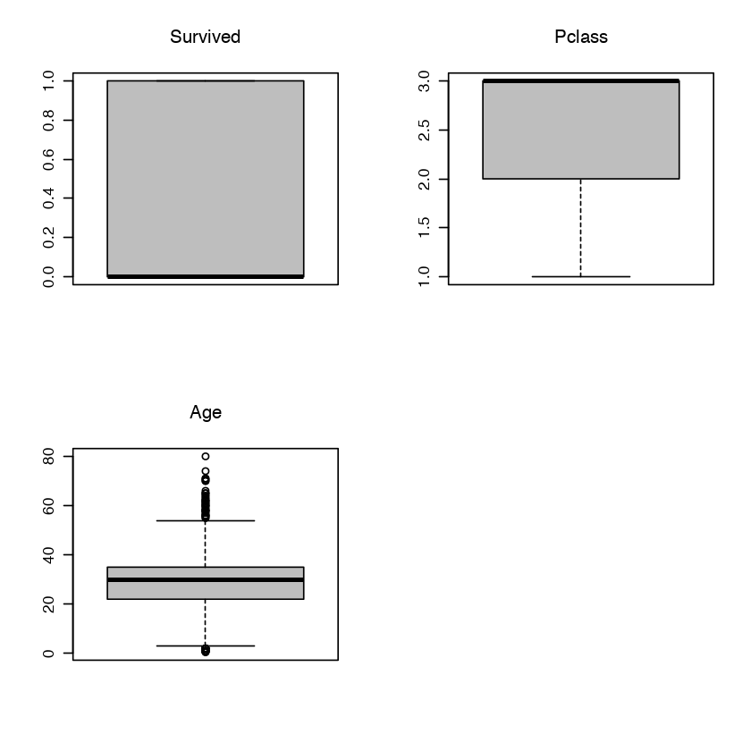

<div style="width: 100%; clear: both;">
<div style="float: left; width: 50%;">

</div>
<div style="float: right; width: 50%;">
<p style="margin: 0; padding-top: 22px; text-align:right;">M2.851 - Tipología y ciclo de vida de los datos aula 1 · Práctica 1</p>
<p style="margin: 0; text-align:right;">2018 · Máster universitario en Ciencia de datos (Data science)</p>
<p style="margin: 0; text-align:right;">Prof. Colaboradora: <b>Mireia Calvo Gonzalez</b></p>
<p style="margin: 0; text-align:right; padding-button: 100px;">Alumno: <b>Fernando Antonio Barbeiro Campos</b> - <a href="">fbarbeiro@uoc.edu</a></p>
</div>
</div>
<div style="width:100%;">&nbsp;</div>
<center><h1>Práctica 2 - Limpieza y validación de los datos</h1></center>


## 1. Dataset
*Descripción del dataset. ¿Por qué es importante y qué pregunta/problema pretende responder?*

He elegido el dataset ["**Titanic: Machine Learning from Disaster**" de Kagle](https://www.kaggle.com/c/titanic/overview). La información presente en el dataset són datos sobre cada pasajero del famoso naufragio, si la persona sobrevivió o no, su sexo, tipo de cabina que estaba, entre otros.

Aunque hubo algún elemento de suerte involucrado en sobrevivir al hundimiento, algunos grupos de personas tenían más probabilidades de sobrevivir que otros, como las mujeres, los niños y la clase alta.

Justamente, el problema que buscamos a contestar es precisamente esto: hacer el análisis de **¿qué tipos de personas podrían sobrevivir?**


Aún hablando un poco sobre el dataset, vamos a mirar un poco más de información sobre el mismo:


```R
# Objetivo: Asegurar que estamos trabajando con el formato en ingles separado por comas
L <- readLines("train.csv", n = 1)
if (grepl(",", L)) print("File has an English format")
```

    [1] "File has an English format"


```R
# Como estamos trabajando con ficheros separados por commas, vamos a mirar un poco de datos
df <- read.csv("train.csv")
head(df)

# Mirando los nombres de columnas del dataframe y los tipos de variables y informacion adicional
print(paste("We are evaluating", nrow(df), "rows of code"))
print("Column's names: ")
colnames(df)
sapply(df,class)
str(df)
summary(df)
```


<table>
<thead><tr><th scope=col>PassengerId</th><th scope=col>Survived</th><th scope=col>Pclass</th><th scope=col>Name</th><th scope=col>Sex</th><th scope=col>Age</th><th scope=col>SibSp</th><th scope=col>Parch</th><th scope=col>Ticket</th><th scope=col>Fare</th><th scope=col>Cabin</th><th scope=col>Embarked</th></tr></thead>
<tbody>
	<tr><td>1                                                  </td><td>0                                                  </td><td>3                                                  </td><td>Braund, Mr. Owen Harris                            </td><td>male                                               </td><td>22                                                 </td><td>1                                                  </td><td>0                                                  </td><td>A/5 21171                                          </td><td> 7.2500                                            </td><td>                                                   </td><td>S                                                  </td></tr>
	<tr><td>2                                                  </td><td>1                                                  </td><td>1                                                  </td><td>Cumings, Mrs. John Bradley (Florence Briggs Thayer)</td><td>female                                             </td><td>38                                                 </td><td>1                                                  </td><td>0                                                  </td><td>PC 17599                                           </td><td>71.2833                                            </td><td>C85                                                </td><td>C                                                  </td></tr>
	<tr><td>3                                                  </td><td>1                                                  </td><td>3                                                  </td><td>Heikkinen, Miss. Laina                             </td><td>female                                             </td><td>26                                                 </td><td>0                                                  </td><td>0                                                  </td><td>STON/O2. 3101282                                   </td><td> 7.9250                                            </td><td>                                                   </td><td>S                                                  </td></tr>
	<tr><td>4                                                  </td><td>1                                                  </td><td>1                                                  </td><td>Futrelle, Mrs. Jacques Heath (Lily May Peel)       </td><td>female                                             </td><td>35                                                 </td><td>1                                                  </td><td>0                                                  </td><td>113803                                             </td><td>53.1000                                            </td><td>C123                                               </td><td>S                                                  </td></tr>
	<tr><td>5                                                  </td><td>0                                                  </td><td>3                                                  </td><td>Allen, Mr. William Henry                           </td><td>male                                               </td><td>35                                                 </td><td>0                                                  </td><td>0                                                  </td><td>373450                                             </td><td> 8.0500                                            </td><td>                                                   </td><td>S                                                  </td></tr>
	<tr><td>6                                                  </td><td>0                                                  </td><td>3                                                  </td><td>Moran, Mr. James                                   </td><td>male                                               </td><td>NA                                                 </td><td>0                                                  </td><td>0                                                  </td><td>330877                                             </td><td> 8.4583                                            </td><td>                                                   </td><td>Q                                                  </td></tr>
</tbody>
</table>


    [1] "We are evaluating 891 rows of code"
    [1] "Column's names: "


<ol class=list-inline>
	<li>'PassengerId'</li>
	<li>'Survived'</li>
	<li>'Pclass'</li>
	<li>'Name'</li>
	<li>'Sex'</li>
	<li>'Age'</li>
	<li>'SibSp'</li>
	<li>'Parch'</li>
	<li>'Ticket'</li>
	<li>'Fare'</li>
	<li>'Cabin'</li>
	<li>'Embarked'</li>
</ol>


<dl class=dl-horizontal>
	<dt>PassengerId</dt>
		<dd>'integer'</dd>
	<dt>Survived</dt>
		<dd>'integer'</dd>
	<dt>Pclass</dt>
		<dd>'integer'</dd>
	<dt>Name</dt>
		<dd>'factor'</dd>
	<dt>Sex</dt>
		<dd>'factor'</dd>
	<dt>Age</dt>
		<dd>'numeric'</dd>
	<dt>SibSp</dt>
		<dd>'integer'</dd>
	<dt>Parch</dt>
		<dd>'integer'</dd>
	<dt>Ticket</dt>
		<dd>'factor'</dd>
	<dt>Fare</dt>
		<dd>'numeric'</dd>
	<dt>Cabin</dt>
		<dd>'factor'</dd>
	<dt>Embarked</dt>
		<dd>'factor'</dd>
</dl>


    'data.frame':	891 obs. of  12 variables:
     $ PassengerId: int  1 2 3 4 5 6 7 8 9 10 ...
     $ Survived   : int  0 1 1 1 0 0 0 0 1 1 ...
     $ Pclass     : int  3 1 3 1 3 3 1 3 3 2 ...
     $ Name       : Factor w/ 891 levels "Abbing, Mr. Anthony",..: 109 191 358 277 16 559 520 629 417 581 ...
     $ Sex        : Factor w/ 2 levels "female","male": 2 1 1 1 2 2 2 2 1 1 ...
     $ Age        : num  22 38 26 35 35 NA 54 2 27 14 ...
     $ SibSp      : int  1 1 0 1 0 0 0 3 0 1 ...
     $ Parch      : int  0 0 0 0 0 0 0 1 2 0 ...
     $ Ticket     : Factor w/ 681 levels "110152","110413",..: 524 597 670 50 473 276 86 396 345 133 ...
     $ Fare       : num  7.25 71.28 7.92 53.1 8.05 ...
     $ Cabin      : Factor w/ 148 levels "","A10","A14",..: 1 83 1 57 1 1 131 1 1 1 ...
     $ Embarked   : Factor w/ 4 levels "","C","Q","S": 4 2 4 4 4 3 4 4 4 2 ...


      PassengerId       Survived          Pclass     
     Min.   :  1.0   Min.   :0.0000   Min.   :1.000  
     1st Qu.:223.5   1st Qu.:0.0000   1st Qu.:2.000  
     Median :446.0   Median :0.0000   Median :3.000  
     Mean   :446.0   Mean   :0.3838   Mean   :2.309  
     3rd Qu.:668.5   3rd Qu.:1.0000   3rd Qu.:3.000  
     Max.   :891.0   Max.   :1.0000   Max.   :3.000  
                                                     
                                        Name         Sex           Age       
     Abbing, Mr. Anthony                  :  1   female:314   Min.   : 0.42  
     Abbott, Mr. Rossmore Edward          :  1   male  :577   1st Qu.:20.12  
     Abbott, Mrs. Stanton (Rosa Hunt)     :  1                Median :28.00  
     Abelson, Mr. Samuel                  :  1                Mean   :29.70  
     Abelson, Mrs. Samuel (Hannah Wizosky):  1                3rd Qu.:38.00  
     Adahl, Mr. Mauritz Nils Martin       :  1                Max.   :80.00  
     (Other)                              :885                NA's   :177    
         SibSp           Parch             Ticket         Fare       
     Min.   :0.000   Min.   :0.0000   1601    :  7   Min.   :  0.00  
     1st Qu.:0.000   1st Qu.:0.0000   347082  :  7   1st Qu.:  7.91  
     Median :0.000   Median :0.0000   CA. 2343:  7   Median : 14.45  
     Mean   :0.523   Mean   :0.3816   3101295 :  6   Mean   : 32.20  
     3rd Qu.:1.000   3rd Qu.:0.0000   347088  :  6   3rd Qu.: 31.00  
     Max.   :8.000   Max.   :6.0000   CA 2144 :  6   Max.   :512.33  
                                      (Other) :852                   
             Cabin     Embarked
                :687    :  2   
     B96 B98    :  4   C:168   
     C23 C25 C27:  4   Q: 77   
     G6         :  4   S:644   
     C22 C26    :  3           
     D          :  3           
     (Other)    :186           


## 2. Integración y selección de los datos de interés a analizar

Ahora que tenemos un poco más de información sobre el dataset, detectamos que algunas de las columnas no aportan mucho para el tipo de conocimiento que necesitamos recolectar. Por ejemplo, el número del *ticket* de cada persona es bastante irrelevante para extraer un modelo y predecir si la persona ha sobrevivido o no. Dicho, con el intuito de obtener un modelo significativo, he elegido los siguientes atributos para el analisis:
- *Survived*
- *Pclass*
- *Name*
- *Sex*
- *Age*

Queda claro que el atributo **Name** tampoco es relevante, pero mantuve por si acaso necesito explicar o hacer alguna comparación de pasajeros (será más sencillo identificar las personas por sus nombres). 

Definidos los atributos, antes de seguir para el próximo ejercício, hago la selección de los datos que vamos a trabajar abajo.


```R
df <- df[,2:6] 
head(df)
```


<table>
<thead><tr><th scope=col>Survived</th><th scope=col>Pclass</th><th scope=col>Name</th><th scope=col>Sex</th><th scope=col>Age</th></tr></thead>
<tbody>
	<tr><td>0                                                  </td><td>3                                                  </td><td>Braund, Mr. Owen Harris                            </td><td>male                                               </td><td>22                                                 </td></tr>
	<tr><td>1                                                  </td><td>1                                                  </td><td>Cumings, Mrs. John Bradley (Florence Briggs Thayer)</td><td>female                                             </td><td>38                                                 </td></tr>
	<tr><td>1                                                  </td><td>3                                                  </td><td>Heikkinen, Miss. Laina                             </td><td>female                                             </td><td>26                                                 </td></tr>
	<tr><td>1                                                  </td><td>1                                                  </td><td>Futrelle, Mrs. Jacques Heath (Lily May Peel)       </td><td>female                                             </td><td>35                                                 </td></tr>
	<tr><td>0                                                  </td><td>3                                                  </td><td>Allen, Mr. William Henry                           </td><td>male                                               </td><td>35                                                 </td></tr>
	<tr><td>0                                                  </td><td>3                                                  </td><td>Moran, Mr. James                                   </td><td>male                                               </td><td>NA                                                 </td></tr>
</tbody>
</table>


## 3. Limpieza de los datos

### 3.1. ¿Los datos contienen ceros o elementos vacíos? ¿Cómo gestionarías cada uno de estos casos?


```R
# Como resultado del comando abajo, podemos ver que solamente Age tiene elementos NA
unlist(lapply(df, function(x) any(is.na(x))))
              
sapply(df, function(x) sum(is.na(x)))

# Abajo comentaré las aproximaciones posibles para el escenario y la adoptada              
df_no_NA <- df[rowSums(is.na(df)) == 0,]
nrow(df_no_NA)
options(warn=-1)             
for(i in 1:ncol(df)){
  df[is.na(df[,i]), i] <- mean(df[,i], na.rm = TRUE)
}
options(warn=0)          
unlist(lapply(df, function(x) any(is.na(x))))
nrow(df)
```


<dl class=dl-horizontal>
	<dt>Survived</dt>
		<dd>FALSE</dd>
	<dt>Pclass</dt>
		<dd>FALSE</dd>
	<dt>Name</dt>
		<dd>FALSE</dd>
	<dt>Sex</dt>
		<dd>FALSE</dd>
	<dt>Age</dt>
		<dd>FALSE</dd>
</dl>


<dl class=dl-horizontal>
	<dt>Survived</dt>
		<dd>0</dd>
	<dt>Pclass</dt>
		<dd>0</dd>
	<dt>Name</dt>
		<dd>0</dd>
	<dt>Sex</dt>
		<dd>0</dd>
	<dt>Age</dt>
		<dd>0</dd>
</dl>


891


<dl class=dl-horizontal>
	<dt>Survived</dt>
		<dd>FALSE</dd>
	<dt>Pclass</dt>
		<dd>FALSE</dd>
	<dt>Name</dt>
		<dd>FALSE</dd>
	<dt>Sex</dt>
		<dd>FALSE</dd>
	<dt>Age</dt>
		<dd>FALSE</dd>
</dl>


891


Como podemos notar, solamente la columna **Age** presentaba **datos vacíos**. Además, la cantidad de registros que estamos trabajando tampoco es masiva, es decir, **tenemos un muestreo pequeño de datos (891 registros)**.

Esto básicamente motiva con que no adoptaramos una aproximación posible en los casos de datos vacíos (NA):

- **Eliminación de registros (filas) donde haya a ocurrencia de NAs**

Como podemos ver en el dataset `df_no_NA`, quedaríamos simplemente con `714` filas para trabajar (particularmente he considerado poco), por lo tanto, he adoptado una aproximación distinta:

- **Calcular un pormedio basado en la información de las otras filas para los casos donde hubiera un elemento vacío**

Finalmente había un registro NA en la última línea del comando `head(df)` (*Moran, Mr. James*) veamos como ha quedado los datos de Age ahora:


```R
head(df)
```


<table>
<thead><tr><th scope=col>Survived</th><th scope=col>Pclass</th><th scope=col>Name</th><th scope=col>Sex</th><th scope=col>Age</th></tr></thead>
<tbody>
	<tr><td>0                                                  </td><td>3                                                  </td><td>Braund, Mr. Owen Harris                            </td><td>male                                               </td><td>22.00000                                           </td></tr>
	<tr><td>1                                                  </td><td>1                                                  </td><td>Cumings, Mrs. John Bradley (Florence Briggs Thayer)</td><td>female                                             </td><td>38.00000                                           </td></tr>
	<tr><td>1                                                  </td><td>3                                                  </td><td>Heikkinen, Miss. Laina                             </td><td>female                                             </td><td>26.00000                                           </td></tr>
	<tr><td>1                                                  </td><td>1                                                  </td><td>Futrelle, Mrs. Jacques Heath (Lily May Peel)       </td><td>female                                             </td><td>35.00000                                           </td></tr>
	<tr><td>0                                                  </td><td>3                                                  </td><td>Allen, Mr. William Henry                           </td><td>male                                               </td><td>35.00000                                           </td></tr>
	<tr><td>0                                                  </td><td>3                                                  </td><td>Moran, Mr. James                                   </td><td>male                                               </td><td>29.69912                                           </td></tr>
</tbody>
</table>


Para cerrar el tema de los *Missing Values*, hay otras aproximaciones que no parecían adecuadas para el escenario, sin embargo añado para dejar claro que las he tenido en cuenta:

- **Rellenar manualmente los valores que faltan**
- **Rellenar con una constante global**
- **Rellenar con un valor más probable (podría ser echo con una regresión, por ejemplo)**


### 3.2. Identificación y tratamiento de valores extremos

La verdad es que, mismo antes de seguir con el analisis si hay o no valores extremos (*outliers*) queda evidente que hay pocas posibilidades de haber muchos problemas, dado que tenemos simplemente 3 columnas con valores numericos (siendo una de ellas, la columna de **Survived** que es precisamente la columna del *label* del dataset - o sea, ahí seguramente que no habrá problemas).


```R
sapply(df,class)
```


<dl class=dl-horizontal>
	<dt>Survived</dt>
		<dd>'numeric'</dd>
	<dt>Pclass</dt>
		<dd>'numeric'</dd>
	<dt>Name</dt>
		<dd>'factor'</dd>
	<dt>Sex</dt>
		<dd>'factor'</dd>
	<dt>Age</dt>
		<dd>'numeric'</dd>
</dl>


```R
par(mfrow=c(2,2))
for(i in 1:ncol(df)) {
    if (is.numeric(df[,i])){
        boxplot(df[,i], main = colnames(df)[i], width = 100, col="gray")
    }
}

max(df$Age, na.rm = TRUE)
min(df$Age, na.rm = TRUE)
fivenum(df$Age)
```


80


0.42


<ol class=list-inline>
	<li>0.42</li>
	<li>22</li>
	<li>29.6991176470588</li>
	<li>35</li>
	<li>80</li>
</ol>





Con esto, hay valores que aparecen en los boxplots como *outliers* en **Age**, y es completamente factible que una persona en el Titanic tuviera `80` años (y también `0.4` años, en el caso de un bebé). 

**Los outliers afectan especialmente a la media (medida poco robusta). Y cuando la muestra es pequeña como en nuestro, el efecto se nota aún más acentuado.**

Como forma de tratamiento de valores extremos, una posible aproximación es la tecnica de *Binning* (discretización) que creo ser perfecta para la columna en cuestión.


```R
df$Age <- as.factor(ifelse(df$Age >= 21, "Adult", "Underage"))
sapply(df,class)
tail(df)
```


<dl class=dl-horizontal>
	<dt>Survived</dt>
		<dd>'numeric'</dd>
	<dt>Pclass</dt>
		<dd>'numeric'</dd>
	<dt>Name</dt>
		<dd>'factor'</dd>
	<dt>Sex</dt>
		<dd>'factor'</dd>
	<dt>Age</dt>
		<dd>'factor'</dd>
</dl>


<table>
<thead><tr><th></th><th scope=col>Survived</th><th scope=col>Pclass</th><th scope=col>Name</th><th scope=col>Sex</th><th scope=col>Age</th></tr></thead>
<tbody>
	<tr><th scope=row>886</th><td>0                                       </td><td>3                                       </td><td>Rice, Mrs. William (Margaret Norton)    </td><td>female                                  </td><td>Adult                                   </td></tr>
	<tr><th scope=row>887</th><td>0                                       </td><td>2                                       </td><td>Montvila, Rev. Juozas                   </td><td>male                                    </td><td>Adult                                   </td></tr>
	<tr><th scope=row>888</th><td>1                                       </td><td>1                                       </td><td>Graham, Miss. Margaret Edith            </td><td>female                                  </td><td>Underage                                </td></tr>
	<tr><th scope=row>889</th><td>0                                       </td><td>3                                       </td><td>Johnston, Miss. Catherine Helen "Carrie"</td><td>female                                  </td><td>Adult                                   </td></tr>
	<tr><th scope=row>890</th><td>1                                       </td><td>1                                       </td><td>Behr, Mr. Karl Howell                   </td><td>male                                    </td><td>Adult                                   </td></tr>
	<tr><th scope=row>891</th><td>0                                       </td><td>3                                       </td><td>Dooley, Mr. Patrick                     </td><td>male                                    </td><td>Adult                                   </td></tr>
</tbody>
</table>


Explicando el enfoque: 

Como en algunas ocasiones, la información tiene un poco de *ruido*, nos interesa reducir al máximo lo mismo y, para ello, una posible solución es discretizar. Así, una serie de valores son los representantes de la variable cuantitativa (en nuestro caso *Underage* y *Adult* son los representantes).

Otras aproximaciones y tecnicas también podrían estar empleadas aquí, como *Regression* u *Outlier Analysis*, sin embargo, la que haría más sentido para lo que buscamos es si duda el *Binning*.

## 4. Análisis de los datos

### 4.1. Selección de los grupos de datos que se quieren analizar/comparar (planificación de los análisis a aplicar)


```R
# Agrupación por sexo
df.male <- df[df$Sex == "male",] 
df.female <- df[df$Sex == "female",] 

# Por Edad
df.adult <- df[df$Age == "Adult",] 
df.underage <- df[df$Age == "Underage",] 

# Por Cabina
df.first_class <- df[df$Pclass == 1,] 
df.second_class <- df[df$Pclass == 2,] 
df.third_class <- df[df$Pclass == 3,]

print(paste("Hombres: ", nrow(df.male)))
print(paste("Mujeres: ", nrow(df.female)))
print("------------------------------------------------")
print(paste("Adultos: ", nrow(df.adult)))
print(paste("No adultos: ", nrow(df.underage)))
print("------------------------------------------------")
print(paste("Primera clase: ", nrow(df.first_class)))
print(paste("Segunda clase: ", nrow(df.second_class)))
print(paste("Tercera clase: ", nrow(df.third_class)))
```

    [1] "Hombres:  577"
    [1] "Mujeres:  314"
    [1] "------------------------------------------------"
    [1] "Adultos:  711"
    [1] "No adultos:  180"
    [1] "------------------------------------------------"
    [1] "Primera clase:  216"
    [1] "Segunda clase:  184"
    [1] "Tercera clase:  491"


### 4.2. Comprobación de la normalidad y homogeneidad de la varianza


```R
#"The distribution of Y within each group is normally distributed." It's the same thing as Y|X and in this context, it's the same as saying the residuals are normally distributed.
#DS <- summarize( group_by(data, Tipo), n=length(df), p.shapiro=shapiro.test(df)[[2]])
#DS


# H0: la muestra (de tamaño n) sigue una distribución normal
# Se rechaza H0 si p value < alfa
# Si se aplica Shapiro (en toda la muestra)

alpha = 0.05

ST_P <- shapiro.test(df$Pclass)
ST_P

ST_S <- shapiro.test(df$Survived)
ST_S

pvalue_P <- ST_P[[2]]
pvalue_S <- ST_S[[2]]
pvalue_P
pvalue_S
```


    
    	Shapiro-Wilk normality test
    
    data:  df$Pclass
    W = 0.71833, p-value < 2.2e-16


    
    	Shapiro-Wilk normality test
    
    data:  df$Survived
    W = 0.61666, p-value < 2.2e-16


3.39303101282384e-36


1.79425301229117e-40


En el test de Shapiro-Wilk, cuando P r(D) ≥ α entonces se acepta la hipótesis nula, existe
normalidad. El valor p del test de Shapiro ha dado para Pclass y Survived respectivamente 3.39 y 1.79. Por tanto, no se rechaza la hipótesis nula de normalidad. Asumimos que la muestra sigue una distribución normal.


```R

fligner.test(Survived ~ Pclass, data = df)
```


    
    	Fligner-Killeen test of homogeneity of variances
    
    data:  Survived by Pclass
    Fligner-Killeen:med chi-squared = 35.766, df = 2, p-value = 1.712e-08


Dado que obtuvimos *p-value* de 1.71 o sea, superior a α, aceptamos la hipótesis de que las varianzas son homogéneas.

### 4.3. Aplicación de pruebas estadísticas para comparar los grupos de datos. En función de los datos y el objetivo del estudio, aplicar pruebas de contraste de hipótesis, correlaciones, regresiones, etc.


```R

```

## 5. Representación de los resultados a partir de tablas y gráficas

## 6. Resolución del problema. A partir de los resultados obtenidos, ¿cuáles son las conclusiones? ¿Los resultados permiten responder al problema?


## 7. Código


